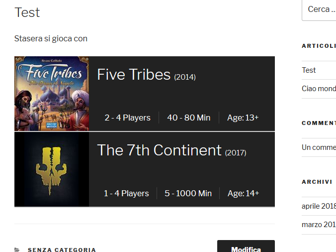

# BoardGameGeek Card

Insert boardgame info from https://boardgamegeek.com/ in a card in posts.

## Install

- Upload the plugin files to the `/wp-content/plugins/boardgamegeek` directory, or install the plugin through the WordPress plugins screen directly.
- Activate the plugin through the 'Plugins' screen in WordPress

## Use

The plugin define a new shortcode 

    [bgg id-of-game]

where `id-of-game` is the id from https://boardgamegeek.com/

### Example

A post source like

    Stasera si gioca con
    
    [bgg 157354]
    [bgg 180263]

Is redendered as

## Personalize

`gamecard.php` is the template for the boardgame.
It knows `$gameid` (the id passed as argument), and `$bg`, a SimpleDOMElement,
result of parsing XML api from https://boardgamegeek.com/

`style.css` is where the style of the card is defined.

